#   VE Mobile


[](LICENSE)
[](https://github.com/Silvestrae/ve-mobile/releases)

VE Mobile brings a purpose-built phone and tablet interface to your Foundry
Virtual Tabletop game. Read your character, use spells and items, follow chat,
and interact with the Scene through layouts designed for touch. It runs in
your browser, inside your existing authenticated Foundry session—no separate
app is required.

The screenshots below show VE Mobile running in Foundry VTT with D&D5e.

<p align="center">
  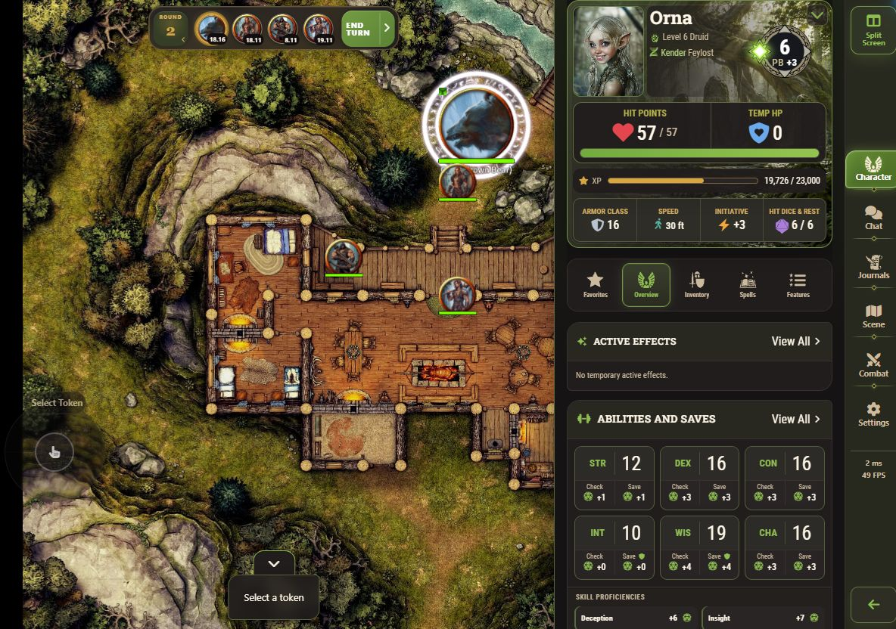
</p>

## Why VE Mobile?

VE Mobile gives phones and tablets their own interface, rather than simply
shrinking Foundry's desktop workspace. Dedicated Character, NPC, Group, and
Vehicle sheets make common information and actions accessible on a narrow
screen. Phone, Tablet Split, and Tablet Full presentations adapt navigation
and content to the space available.

On a tablet, keep the Scene alongside your sheet or chat. When you do not need
the map, no-Canvas mode lets you use sheets, chat, and journals with less
graphics work. Graphics profiles, loading status, resync, and recovery controls
help you manage the practical limits of mobile hardware and connections.

Rolls and supported activities use Foundry and D&D5e's native action pathways.
Your game keeps its rules, permissions, chat cards, and automation; VE Mobile
provides the touch interface for using them.

## Contents

- [Why VE Mobile?](#why-ve-mobile)
- [Features at a Glance](#features-at-a-glance)
- [Phone and Tablet Layouts](#phone-and-tablet-layouts)
- [Character and Actor Sheets](#character-and-actor-sheets)
- [Scene and Touch Controls](#scene-and-touch-controls)
- [Quickbar, Actions, and Gameplay](#quickbar-actions-and-gameplay)
- [Chat, Journals, and Combat](#chat-journals-and-combat)
- [Performance and Mobile Graphics](#performance-and-mobile-graphics)
- [Compatibility and Requirements](#compatibility-and-requirements)
- [Languages](#languages)
- [Controls and Gestures](#controls-and-gestures)
- [Installation](#installation)
- [Settings](#settings)
- [Reporting Bugs](#reporting-bugs)
- [Support](#support)
- [License](#license)
- [Screenshot Credits](#screenshot-credits)
- [Disclaimer and Independence](#disclaimer-and-independence)

## Features at a Glance

| Area | What you can do |
| --- | --- |
| Layouts | Use Phone, Tablet Split, or Tablet Full, with light and dark presentation. |
| Actor sheets | Browse PCs, NPCs, Groups, and Vehicles through dedicated layouts and a folder-based chooser. |
| Gameplay | Roll checks and saves, use items and spells, manage supported resources, and open native action dialogs. |
| Scene | Pan, zoom, select, target, and move permitted tokens with touch controls and a joystick. |
| Action bar | Choose Character Quickbar or Foundry Hotbar, with ten slots per page and five pages. |
| Reading and communication | Use native chat, read journals and images, and follow combat turn order. |
| Mobile operation | Use Keep Screen Awake, graphics profiles, no-Canvas mode, connection status, and recovery tools. |
| Languages | Use VE's interface in US or Australian English, Spanish, German, French, or Italian. |

Available information and actions follow your Foundry permissions and the
capabilities of the selected Actor, item, or Scene.

## Phone and Tablet Layouts

- **Phone** uses bottom navigation and a single content pane. Character headers
  compact as you scroll, keeping key stats and section tabs close at hand.
- **Tablet Split** puts the live Scene beside your selected content in
  landscape, so you can consult a sheet or chat while keeping the map visible.
  Character headers compact as you scroll the sheet pane.
- **Tablet Full** gives the selected sheet or content the main surface, with
  side navigation and wider layouts where useful. Character headers stay
  expanded while you scroll.

Auto-detect chooses a presentation for your device; you can also select Phone,
Tablet, or Desktop explicitly. The layout responds to viewport changes, and
Tablet's Split Screen control switches between Split and Full.

<p align="center">
  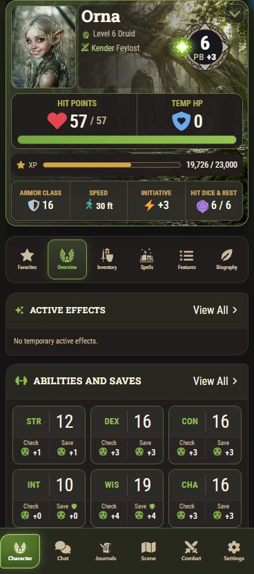
  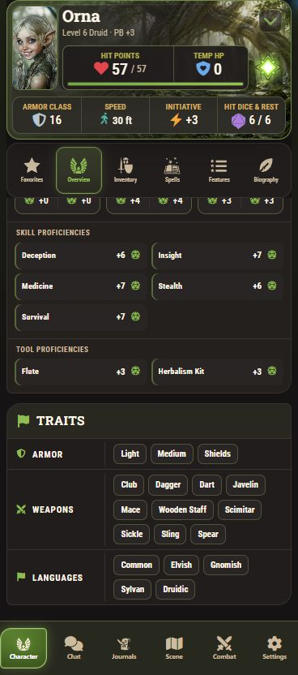
</p>

<p align="center">
  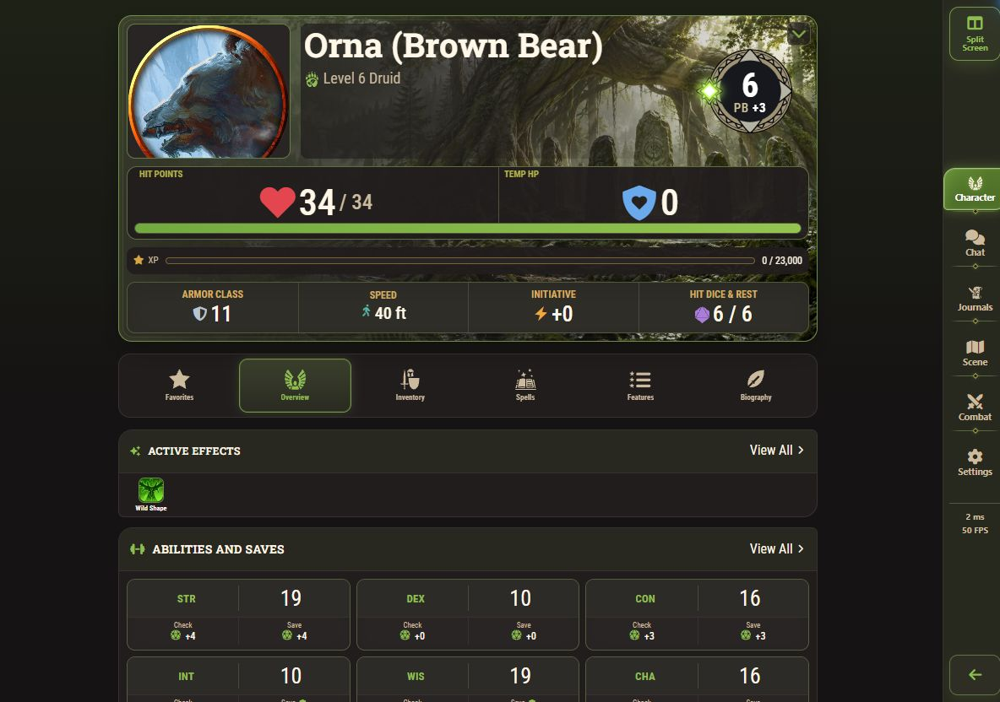
</p>

## Character and Actor Sheets

### Characters and NPCs

Move between Favorites, Overview, Inventory, Spells, Features, and Biography.
Browse Actors through folders, open portraits in the image viewer, and return
to previous content with integrated navigation.

Character section tabs stay in place while their content scrolls. Each subtab
remembers its scroll position and disclosure choices for the current session;
the first meaningful group opens initially. These choices are kept separately
for each exact Actor or token Actor view.

Supported controls include HP and temporary HP, resources and spell slots,
conditions and effects, Heroic Inspiration, death saves, hit dice and rests,
abilities, saving throws, skills, and movement choices. Inventory includes
containers, currency, and supported equipment controls. Spell and feature
lists offer details, native use actions, sorting, and contextual menus.

NPCs show their own identity and challenge information. Character artwork and
class accents personalize the sheet; automatic banners have fallback artwork,
with explicit banner choices and an Off option in Settings.

<p align="center">
  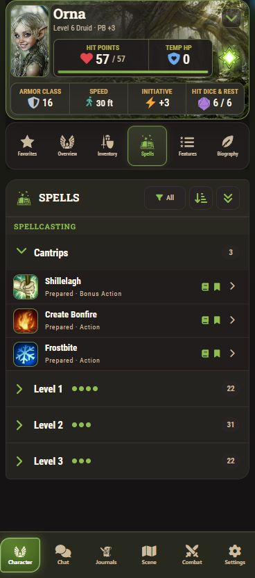
  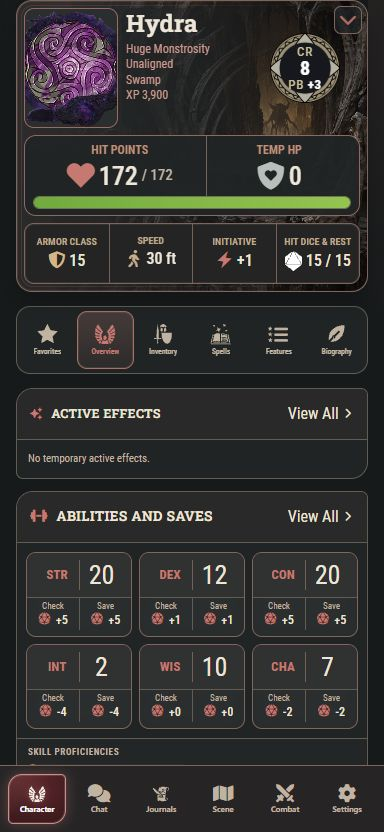
</p>

### Groups and Vehicles

Groups organize **Members**, **Supplies**, and **About**. Review permitted
member summaries, open available member sheets, and return to the Group.
Travel information, shared inventory, and descriptions appear where available.

Vehicles organize **Status**, **Actions**, **Cargo**, and **Details**. Review
condition and defenses, movement and travel, components and stations, cargo,
capacities, and permitted crew references. Supported component and activity
actions use the same native action workflow as other sheets.

The **Native configuration & edit** control opens the assigned native sheet
for broader Group operations and Vehicle configuration. VE does not provide a
mobile editor for every system field.

<p align="center">
  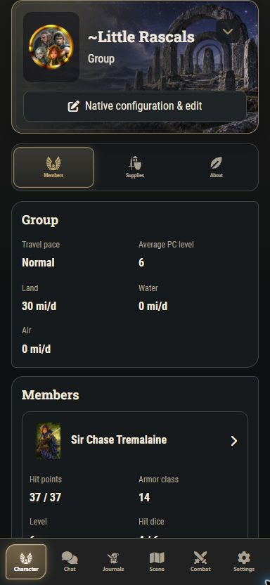
  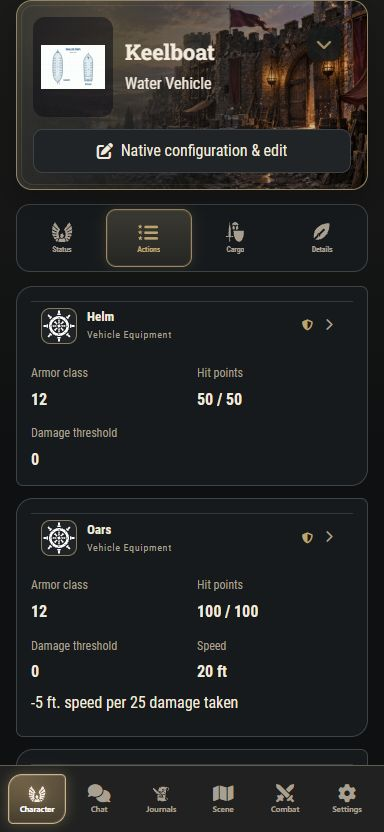
</p>

## Scene and Touch Controls

Use Foundry's live Scene with one-finger panning, two-finger pinch zoom, and
token controls. Tap a token you control to select it; quickly double-tap the
same visible token to toggle targeting. Hold an owned token, then release to
open its native controls, or drag after the hold activates to move it.

The joystick moves the selected token. Native movement, walls, pause rules,
visibility, and ownership still apply. Doors and supported interactive scenery
retain their configured native interactions.

Eligible Actor portraits and chooser rows offer contextual token placement;
Tablet Split also supports portrait placement onto the Scene. Native measured
templates and supported summon placement have touch controls with explicit
confirmation and cancellation. Availability depends on the action and your
permissions.

The Scene requires an enabled Canvas and live map access. Tablet Split keeps
that Scene alongside the sheet or chat shown in the opening screenshot.

## Quickbar, Actions, and Gameplay

Choose **Character Quickbar** for the selected character's shortcuts or
**Foundry Hotbar** for your existing per-user macro assignments. Both provide
ten slots per page, five pages, page selection, and a collapse control.

Hold an item, spell, feature, or favorite to see its available actions,
including adding it to the selected action bar. Browse macro folders and use
native macro editing, assignment, movement, and removal controls where allowed.

<p align="center">
  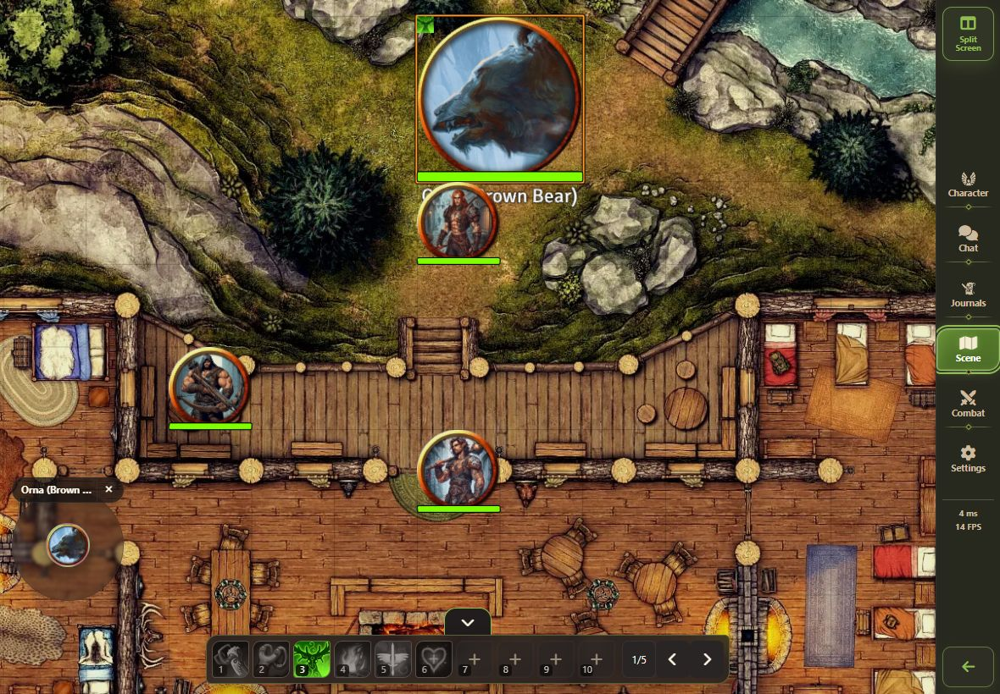
</p>

D&D5e activities, rolls, item use, and spell use go through the normal system
workflow. Native dialogs and follow-up controls remain accessible above VE.
Optional compact action summaries collect available rolls, details, and
permitted target outcomes without replacing the underlying chat cards.

## Chat, Journals, and Combat

**Chat** keeps Foundry's native messages, roll cards, composer, and interactive
content in a contained mobile pane. Supported chat controls, including Dice
Tray and Polyglot's language selector when enabled, travel with that pane.

**Journals** support nested folders, rich pages, heading navigation, and image
viewing. Open the native journal editor when your permissions allow it. Images
can be inspected with touch zoom and pan.

**Combat** shows permitted turn order and role-appropriate controls, including
native End Turn. The optional Scene turn carousel keeps turn order and End Turn
visible at the top of the map during play. Hidden information and GM controls
remain permission-dependent.

<p align="center">
  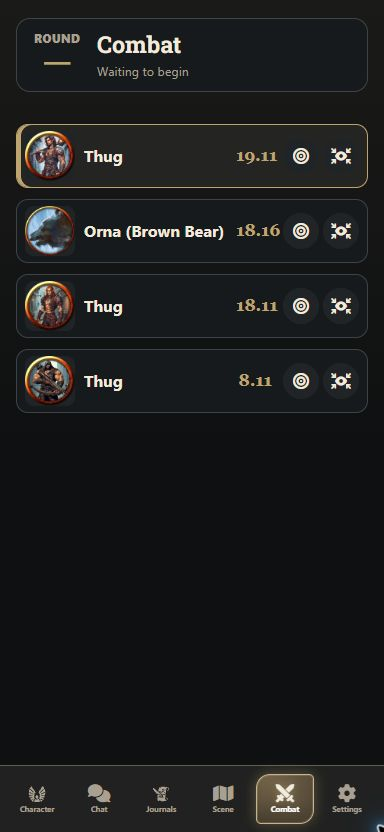
</p>

<p align="center">
  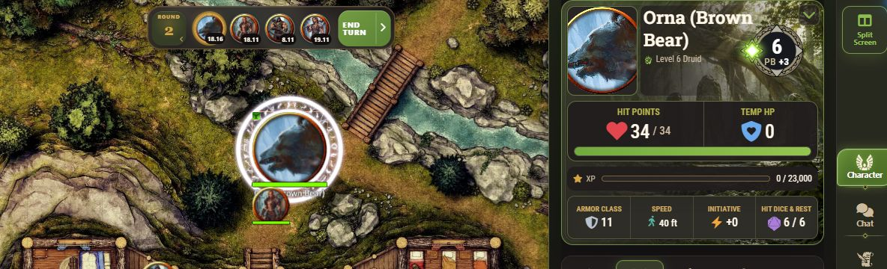
</p>

## Performance and Mobile Graphics

Choose **Normal**, **Balanced**, **Strong**, or **Maximum** graphics profiles
to adjust the amount of graphics work in this browser. Scene memory warnings
and preflight recommendations help identify demanding Scenes; automatic
escalation is optional. These are practical controls, not a guarantee that
every Scene will fit every device.

The **Mobile Asset Optimizer** lets authorized GMs prepare smaller image copies
for mobile use while preserving original files and Scene image paths. Separate
controls cover animated effects and 3D dice. Force Client Settings integration
respects world policy, with a GM-controlled policy for mobile graphics profiles.

**Disable game canvas** offers a no-Canvas option for users who do not need the
Scene or want less graphics work and battery use. Sheets, chat, and journal
reading remain available; map-dependent actions require Canvas. Accept
Foundry's reload flow before assessing a Canvas or graphics change.

<p align="center">
  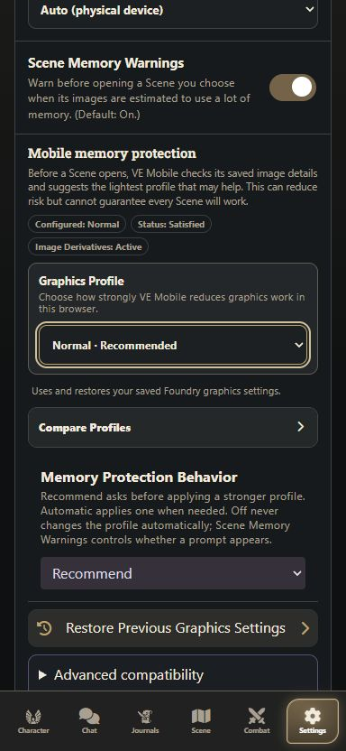
</p>

Loading checkpoints, connection status, reconnect/resync, and graphics recovery
controls make interruptions visible and provide a way to recover. Keep Screen
Awake requests a screen wake lock while VE is active, when the browser supports
it. Temporary graphics changes have restoration and recovery controls.

## Compatibility and Requirements

| Package | Declared minimum | Verified version |
| --- | --- | --- |
| Foundry Virtual Tabletop | 13 | 13.351 |
| Dungeons & Dragons Fifth Edition (`dnd5e`) | 5.3.2 | 5.3.3 |

Declared minimums describe compatibility policy; they do not mean every version
in that range has been tested. Foundry v14 and other game systems are not
advertised as supported here.

You need access to a running Foundry world, an authenticated user account, and
a browser that can run that world. Live Scene use also needs working Canvas
graphics. Device memory, browser capabilities, Scene size, and enabled modules
can affect the experience.

Deliberately maintained interoperability includes:

- **Midi-QOL:** native activity workflows and visible hit/save outcomes in
  action summaries.
- **Dice So Nice:** the normal roll hooks, with mobile dice safety controls.
- **Dice Tray and Polyglot:** native chat input and language controls.
- **Monk's Active Tile Triggers:** supported native scenery interaction paths.
- **Force Client Settings:** authority-aware settings and graphics handling.
- **Simple Calendar and Monk's TokenBar:** recognized overlay patterns in the
  experimental, opt-in Module Overlays controls.

Foundry's module ecosystem is large. These pathways do not promise compatibility
with every version or combination, and experimental overlays are best effort.
Community reports are welcome when a combination reveals an issue.

## Languages

- English (US) — default/base
- English (Australia)
- Spanish
- German
- French
- Italian

VE translates its own interface through Foundry's language loader, including
settings, guides, and recovery messages. Game content, D&D5e, Foundry core, and
other modules use their own translations; VE does not translate campaign text.

## Controls and Gestures

Open **Settings → Support → Controls & Gestures** for the contextual guide.
A dismissible first-use invitation also points to it, and the guide is
available from VE's desktop settings.

Gestures depend on the surface: a list, portrait, token, or piece of scenery
can offer different actions. Moving before a hold activates generally scrolls
or pans. Back or Escape closes the topmost surface first; use the visible
Confirm or Cancel control when a placement asks for a decision.

<p align="center">
  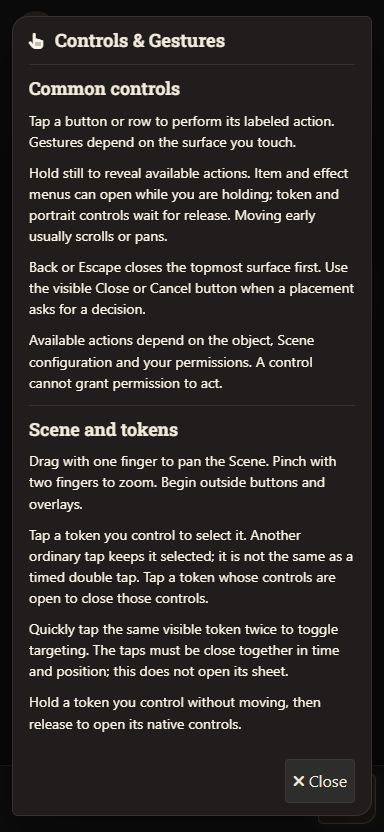
</p>

## Installation

Install VE Mobile with this module manifest URL:

```text
https://github.com/Silvestrae/ve-mobile/releases/latest/download/module.json
```

1. In Foundry's **Setup** screen, open **Add-on Modules → Install Module**.
2. Paste the public link into **Manifest URL** and select **Install**.
3. Launch your D&D5e world and enable **VE Mobile** in **Manage Modules**.
4. Fully reload Foundry, then open the world in your phone or tablet browser.

For a manual installation, download the module ZIP from the
[latest release](https://github.com/Silvestrae/ve-mobile/releases/latest).
Extract it into
`Data/modules/ve-mobile`, with `module.json`, `src`, `assets`, and `locales`
directly inside it. The release ZIP contains the module files at its root.
A GitHub source archive may have an extra outer folder;
Foundry needs `ve-mobile/module.json` at the module root. Enable the module in
the world and fully reload after installation or updates.

## Settings

Use the **Settings** tab for device and power preferences, Scene controls,
appearance, performance, experimental overlays, and support. Open core Foundry
or other module settings through **Open Foundry Settings**. Some native
configuration screens are designed for desktop; Desktop mode remains available
when a screen needs more space.

Choose light, dark, or system appearance, sheet colors, and header artwork.
Controls include joystick placement and repeat speed, action bar choice,
action summaries, and the combat carousel. Reload prompts identify changes
that need a full Foundry reload.

The desktop-return control leaves VE for the current page without changing the
saved Mobile Mode. Select **Desktop** in Mobile Mode when you want it to remain
off after a reload.

## Reporting Bugs

Please report reproducible bugs through
[GitHub Issues](https://github.com/Silvestrae/ve-mobile/issues), using the bug
report template. Use the separate feature request template for suggestions.

Include relevant details:

- VE Mobile, Foundry, and game system versions
- Browser/version, device/model, and operating system
- Phone, Tablet Split, Tablet Full, or Desktop; GM or Player
- Steps to reproduce, expected behavior, and what happened
- Relevant enabled modules
- A screenshot or short video, and a console error if available

Remove passwords, authentication tokens, personal information, and private
campaign content before sharing a report. Reports about specific browsers,
devices, translations, and module combinations help improve the experience.

## Support

If you like VE Mobile and want to say thanks or support its development, you
can buy me a coffee on Ko-fi.

[](https://ko-fi.com/silvestrae)

## License

VE Mobile is released under the [MIT License](LICENSE).
Bundled third-party font and adapted badge artwork retain their license notices
in the stylesheet.

## Screenshot Credits

Battlemap shown in screenshots:
[Cropox Battlemaps — The Deepwood Hunting Lodge 45x40](https://www.patreon.com/CropoxBattlemaps/posts/deepwood-hunting-150490629).
The map is not bundled with VE Mobile and is not covered by VE Mobile's MIT
license.

## Disclaimer and Independence

VE Mobile is an independent module for Foundry Virtual Tabletop. It is not
affiliated with or endorsed by Foundry Gaming LLC or Wizards of the Coast.
It interoperates with Foundry VTT and D&D5e through their normal module and
system ecosystems.
